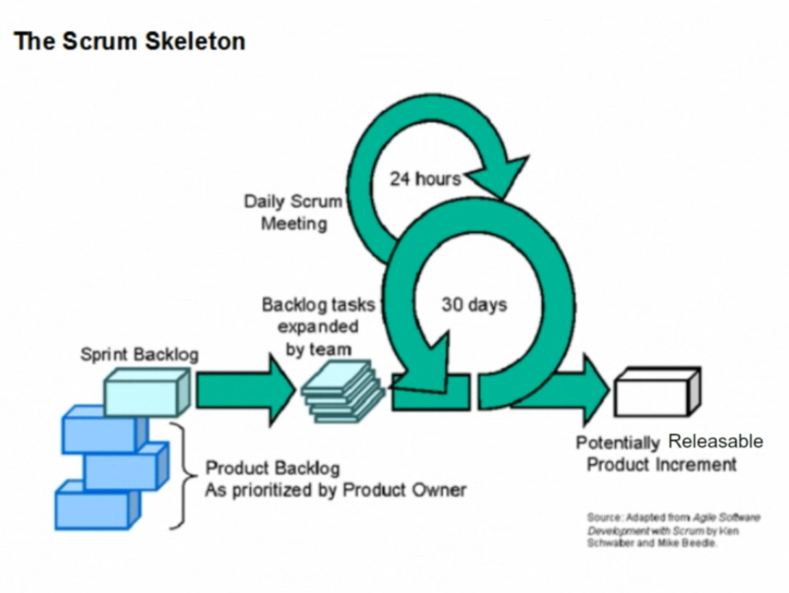

# Manifesto for Agile Software Development

- Individuals and interaction _over_ -> processes and tools
- Working software _over_ -> comprehensive documentation
- Customer collaboration _over_ -> contract negotiation
- Responding to change _over_ -> following a plan

**What is SCRUM** -> a framework for developing and sustaining complex products.
**SCRUM consist of** -> Self organizing, cross functional teams.

**Scrum Theory:**
Based on Empirical Process **Control Theory**

- iterative and
- incremental

Key Point:

- Learning from past mistakes
- Improving
- Making new decisions
- Making changes (adapting)

**SCRUM based on three principles**

1. Transparency (done means done):
   being 'open' & 'honest' as a team
   task is really 'DONE' when it's done
2. Inspections (check on progress)
   two weeks is optimal for the team to gain momentum
3. Adaptation (change the product based on inspection)

##### Scrum Skeleton

##### Four formal events:

- Sprint planning
- Daily Scrum (coordination)
- Sprint Review (make sure shareholders have conversation with team)
- Sprint Retrospective (make sure you improve)

> The product owner is the sole person responsible for managing the Product Backlog

### Scrum Events

- **Sprint** (the heart of scrum): time during which team built a releasable increment of the product. New sprint starts immediately after the conclusion of the previous Sprint.
- **Sprint planning meeting**: team plan the work for the sprint, 4 hours meeting for a two week sprint, 2 topics: "The What"(needs to be done) and "The How"(work will get done) - where team breaking stories into tasks.
  
- **Daily Scrum** (Stand up): SM, Team. 15 min, 3 Questions: 1. What did i do yesterday 2. What will i do 3. Which impediments prevent me from meeting the goal. Scrum master can take notes of any impediments and aim to resolve them as quickly as possible. Any issues can be discussed afterwards. Backlog and burndown are visible. Held at the same place every day to Reduce complexity.
  
- **Sprint Review**: 4hr max. Held at the end of each sprint and allows to demo the increment of the product. Stakeholders ask questions and make suggestions to the product owner. PO make notes to a product backlog and based on suggestions may update it after.
  
- **Sprint Retrospective**: PO, SM, Team. Meeting held after the Sprint Review and before the next Sprint. Everyone answer the questions: 1. What worked in this sprint? 2. What could be improved in the next sprint? This is a chance for the team to inspect and adapt, it generates continuous improvement.
  

All event are time-boxed (every event has a max duration) - used to create regularity and minimize the need for meetings not defined in Scrum.

**Spring Goal** - objective that will be met within the sprint through the implementation of the Product Backlog.

### Scrum Artifacts

... represent work or value to provide transparency and opportunities for inspection and adaptation.

- **Product Backlog**: List of all the features that product owner would like to see in the finished product. Constantly evolves and changes over time. PO works with stakeholders to form requirements and with the team to get suggestions, tech input and estimates.
- _Burndown & Burnup_ charts: monitoring the progress of a release
- **Sprint Backlog** & Burndown: selection from prod backlog picked by the PO and committed by the dev team. Consists of features tasks and their estimated, monitoring the progress.
- **Releasable Product Increment**: piece of functionality delivered by the team at the end of each sprint. should meet team's DOD
  

---

### Agile and Scrum Keywords with Definitions and Explanations

#### Agile

_Definition_: Agile is a set of principles for software development under which requirements and solutions evolve through the collaborative effort of self-organizing and cross-functional teams and their customers/end users.
_Explanation_: Agile promotes adaptive planning, evolutionary development, early delivery, and continuous improvement, encouraging flexible responses to change.

##### Scrum

_Definition_: Scrum is an Agile framework for managing complex projects, typically software development. It is designed for teams of ten or fewer members, who break their work into goals that can be completed within time-boxed iterations called sprints, usually lasting two to four weeks.
_Explanation_: Scrum prescribes three roles (Scrum Master, Product Owner, Development Team), five events (Sprint, Sprint Planning, Daily Scrum, Sprint Review, Sprint Retrospective), and three artifacts (Product Backlog, Sprint Backlog, Increment).

##### Sprint

_Definition_: A sprint is a time-boxed period, typically two to four weeks, during which specific work has to be completed and made ready for review.
Explanation: Sprints create a regular, predictable rhythm for development, allowing teams to assess progress and adapt plans.

##### Product Backlog

Definition: The Product Backlog is an ordered list of everything that is known to be needed in the product. It is the single source of requirements for any changes to be made to the product.
Explanation: Managed by the Product Owner, the Product Backlog is dynamic, evolving as new requirements emerge and the product is developed.

##### Sprint Backlog

Definition: The Sprint Backlog is the set of Product Backlog items selected for the Sprint, plus a plan for delivering the product Increment and realizing the Sprint Goal.
Explanation: It is a highly visible, real-time picture of the work that the Development Team plans to accomplish during the Sprint.

##### Increment

Definition: An Increment is the sum of all the Product Backlog items completed during a Sprint and all previous Sprints.
Explanation: An Increment is a step towards a vision or goal. The Increment must be in useable condition regardless of whether the Product Owner decides to release it.

##### Scrum Master

Definition: The Scrum Master is responsible for promoting and supporting Scrum as defined in the Scrum Guide. Scrum Masters do this by helping everyone understand Scrum theory, practices, rules, and values.
Explanation: The Scrum Master ensures that the team adheres to Scrum practices and helps to remove impediments to the team's progress.

##### Product Owner

Definition: The Product Owner is responsible for maximizing the value of the product resulting from the work of the Development Team.
Explanation: The Product Owner manages the Product Backlog and ensures that the most valuable work is prioritized.

##### Development Team

Definition: The Development Team consists of professionals who work together to deliver a potentially releasable Increment of "Done" product at the end of each Sprint.
Explanation: Development Teams are structured and empowered by the organization to organize and manage their own work.

### Differences Between Agile Frameworks

#### Kanban

Definition: Kanban is a method for managing the creation of products with an emphasis on continuous delivery without overburdening the development team.

##### Key Differences:

Kanban uses a visual board to represent work and its flow.
There are no fixed iterations; work is continuously pulled from a backlog.
Emphasizes work in progress (WIP) limits to manage flow.

#### Lean

Definition: Lean focuses on minimizing waste within manufacturing systems and maximizing productivity.

Key Differences:
Lean principles are applied to improve process efficiency.
Focuses on delivering value to the customer quickly and sustainably.
Emphasizes reducing waste and continuous improvement.

#### Extreme Programming (XP)

Definition: XP is an Agile software development framework that aims to produce higher quality software and higher quality of life for the development team.

Key Differences:
Focuses on technical practices such as Test-Driven Development (TDD), pair programming, and continuous integration.
Emphasizes frequent releases in short development cycles.

##### Why Choose Scrum Over Other Agile Frameworks?

##### Simplicity and Structure:

Scrum provides a simple and flexible framework for teams to manage their work. It includes well-defined roles, events, and artifacts, which make it easier for teams to adopt and practice.
Emphasis on Team Collaboration: Scrum encourages close collaboration among team members, fostering better communication and teamwork.

##### Regular Feedback and Improvement:

The iterative nature of Scrum, with regular sprints and reviews, allows teams to receive frequent feedback and make continuous improvements.

##### Clear Roles and Responsibilities:

Scrum clearly defines roles (Scrum Master, Product Owner, Development Team), which helps avoid confusion and ensures accountability.
Focus on Delivering Value: Scrum prioritizes work based on business value, ensuring that the most valuable features are developed and delivered first.

##### Why Scrum is the Best Choice for Developing an Application

##### Adaptability:

Scrum's iterative approach allows teams to adapt to changing requirements and priorities, which is crucial in application development where customer needs can evolve.

##### Risk Management:

By delivering work in small, manageable increments, Scrum reduces the risk of project failure and ensures that any issues are identified and addressed early.

##### Transparency:

Scrum promotes transparency through daily stand-ups, sprint reviews, and retrospectives, ensuring that all stakeholders are informed and engaged.

##### Customer Satisfaction:

Regularly delivering functional increments allows for early user feedback and higher customer satisfaction, as they can see and use the product as it develops.

##### Continuous Improvement:

Scrum's focus on retrospectives encourages teams to continuously reflect and improve their processes, leading to higher efficiency and better outcomes over time.
